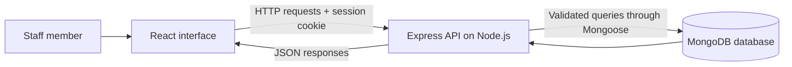

# Hospital Management System — Project Guide

## Objective

Careflow gives hospital staff a connected workspace for patient registration, appointment scheduling, and prescription records. It is designed as a college/portfolio demonstration using fictional data.

## MERN architecture

React manages screens, forms, search, and modal dialogs. Express validates requests and implements authentication and workflow rules. Node.js runs the API and development tools. MongoDB stores every patient, doctor, appointment, prescription, and user. Vite is a frontend build tool, and Mongoose is a MongoDB object modeling library; neither replaces a MERN component.

## Data model

| Collection    | Main fields                                                        | Relationship                                |
| ------------- | ------------------------------------------------------------------ | ------------------------------------------- |
| Users         | Name, email, password hash, role                                   | Staff session identity                      |
| Patients      | Name, contact, birth date, gender, blood group, allergies, history | Referenced by visits and prescriptions      |
| Doctors       | Name, specialty                                                    | Referenced by visits and prescriptions      |
| Appointments  | Patient, doctor, date, time, reason, status                        | Links one patient to one doctor             |
| Prescriptions | Patient, doctor, diagnosis, medication list, instructions          | Linked to the patient's longitudinal record |

## Presentation walkthrough

1. Sign in with the prefilled demo account.
2. Explain the overview metrics, selected-day schedule, and care team.
3. Register a fictional patient with allergies and history.
4. Book a future appointment with a doctor.
5. Try booking the same doctor's slot again to demonstrate conflict prevention.
6. Check the patient in, then complete the visit.
7. Create a prescription with multiple medication entries.
8. Open the patient profile to show linked visits and prescriptions.
9. Open the prescription and use Print to view the printable record or save a PDF.
10. Refresh the page to demonstrate database persistence.

## Implemented safeguards

- Passwords are hashed with bcrypt; session tokens expire after eight hours.
- HTTP-only cookies keep the token out of browser JavaScript.
- Login attempts are rate limited.
- API inputs are validated with Zod.
- A MongoDB unique partial index prevents active double-bookings for a doctor.
- Appointment status transitions are constrained; records are preserved as history.
- Clinical data is fictional and demo prescriptions are explicitly marked.

## Honest scope for your presentation

The implemented product is a local demo with administrator and scoped doctor accounts, editable profiles/photos, record management through archiving, rescheduling of scheduled visits, printable prescriptions, and workload charts. It is not certified hospital software. Future work could include patient accounts, audit trails, appointment reminders, pagination, account recovery/password management, archive restoration, backup/restore, and deployment. Do not present those future features as already implemented.
